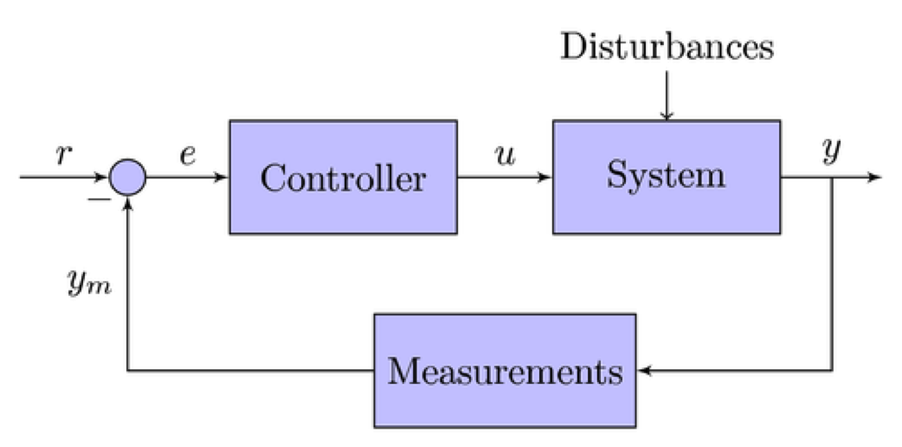

### A system identification toolbox for Julia

#### Cristian R. Rojas, Arda Aytekin and Niklas Everitt

Department of Automatic Control, KTH

#HSLIDE

### Background

- Good software is essential for EE courses at Bachelor and MSc level
- Currently MATLAB® is our main platform, with great variety of toolboxes for control, signal processing, identification, statistics, power systems, ...

#HSLIDE

### Drawbacks

Increasingly more commercial...

- expensive license
- many toolboxes with closed-source code
- black-box GUIs hiding details
- small, selected group of contributors
- sometimes slow…

#HSLIDE

### A recent alternative: Julia

- Recent (2012) programming language for scientific computing
- Simple, dynamic language, similar to Matlab, R and Python
- Free and open source!
- High performance (approaching C)
- Fast growing ecosystem of libraries
- Used for classroom teaching at MIT, Stanford, Cornell…

http://julialang.org

#HSLIDE

### Fast!

#HSLIDE

### However...

- Currently (almost) no supporting libraries for control and system identification

#HSLIDE

### Ultimate goal

- Start the development of a control and identification package in Julia, for use in Bachelor and MSc courses:
	- EL1000: Automatic Control, Basic Course
	- EL1820: Modelling of Dynamical Systems

- Code should be simple, transparent and well documented, so students can modify it, e.g., as part of lab exercises

#HSLIDE

### More specifically...

- Develop basic data types: linear system/models (transfer functions, state-space,…), time/freq domain data

- Code standard methods for manipulating, estimating and plotting models: interconnections, realizations, PEM, spectral estimation, step response, Bode/Nyquist diagrams
