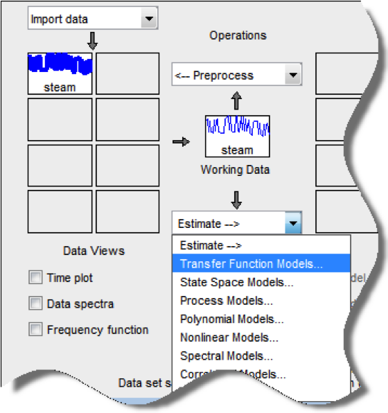

#HSLIDE?image=assets/banner_blue_striped.png
### System Identification and Control Functionality in JULIA

[Cristian R. Rojas](mailto:crro@kth.se), [Arda Aytekin](mailto:aytekin@kth.se)
and [Niklas Everitt](mailto:neveritt@kth.se)

**Department of Automatic Control**,

**KTH Royal Institute of Technology**

#HSLIDE?image=assets/banner_blue_striped.png

#### Background

- Good software is essential for building engineering applications
- Currently MATLAB is our main platform for education, research and industrial use in automatic control
- Great variety of toolboxes for
  control, signal processing, identification, statistics, power systems, ...


#HSLIDE

#### Drawbacks

- Expensive
- Many toolboxes with closed-source code
- Black-box GUIs hiding details
- Limited group of contributors
- Sometimes slow ...



#HSLIDE?image=assets/kth-one-color-plane.png

#### A Recent Alternative: [JULIA](http://julialang.org/)

- Free and open source
- High-level language (like MATLAB, Python)
- Yet, high performance (like C, FORTRAN)
- Ability to generate low-level code for embedding (via LLVM)
- Fast growing ecosystem of libraries
- Already adopted for classroom teaching at MIT, Stanford, Cornell, ...


#VSLIDE?image=assets/kth-one-color-plane.png

#### Did We Mention FAST?


#HSLIDE?image=assets/kth-one-color-plane.png

#### However ...

- Until recently (2015), (almost) no support for control and system identification


#HSLIDE?image=assets/kth-one-color-plane.png

#### Ultimate Goal

- Provide a free, open and extensible ecosystem of packages

- **For Users:** Simple to read, transparent and well-documented, and

- **For Developers:** Compact, modular and easy to maintain

#VSLIDE?image=assets/kth-one-color-plane.png

#### More Specifically ...

- Basic data types: Different LTI representations and their interactions
  (`ControlCore.jl`)
- Interfaces and contracts for compatiblity among packages (`ControlCore.jl`)
- Basic estimation functionality (`IdentificationToolbox.jl`)
- Basic analysis and design functionality (`ControlToolbox.jl`)
- ... maybe some more (`MPCToolbox.jl`)?

#HSLIDE?image=assets/kth-one-color-plane.png

#### [`ControlCore.jl`](https://github.com/KTH-AC/ControlCore.jl)

- Learn from mature packages such as `MathProgBase.jl`, `LearnBase.jl`, ...


#VSLIDE?image=assets/kth-one-color-plane.png

#### Basic Data Types


#VSLIDE?image=assets/kth-one-color-plane.png

#### Parametric Types

- Needed for efficient, compact and flexible representations

```julia
immutable StateSpace{T,S,M<:AbstractMatrix} <: LtiSystem{T,S}
  A::M
  # some more definitions of variables
  # some constructor functions
  # ...
end

# Dense matrices
julia> A1  = eye(N,N); B1 = randn(N,M); C1 = randn(P,N); D1 = randn(P,M);
julia> ss1 = StateSpace(A1,B1,C1,D1);

# Sparse representations
julia> A2  = speye(N,N); B2 = randn(N,M); C2 = randn(P,N); D2 = randn(P,M);
julia> ss2 = StateSpace(A2,B2,C2,D2);
```

#VSLIDE?image=assets/kth-one-color-plane.png

#### Parametric Types

- Also allows for efficient low-level code generation

```julia
julia> f(x::Number, y::Number) = x+y
f (generic function with 1 method)

julia> @code_llvm f(1., 2.)

define double @julia_f_70581(double, double) #0 {
top:
  %2 = fadd double %0, %1
    ret double %2
}
```

#VSLIDE?image=assets/kth-one-color-plane.png

#### Interfaces and Contracts

- A set of interface functions needed for inter-operability

```julia
# at ControlCore.jl
# enforce existence of `poles(sys::LtiSystem)`

# From ControlToolbox.jl perspective
function isstable{T}(sys::ControlCore.LtiSystem{T,Discrete{true}})
  return all(abs(poles(sys)) .< 1.)
end

function isstable{T}(sys::ControlCore.LtiSystem{T,Discrete{false}})
  return all(real(poles(sys)) .< 0.)
end
```

#VSLIDE?image=assets/kth-one-color-plane.png

#### Interfaces and Contracts

```julia
# From SystemIdentification.jl perspective
immutable IdType{T,S,U} <: ControlCore.LtiSystem{T,S}
  sys::U
  # some variables specific to the identification method
end

function poles(sys::IdType)
  # implement to obtain poles of the system
end

# `isstable(sys::IdType)` will simply work
```

#HSLIDE?image=assets/kth-one-color-plane.png

#### [`IdentificationToolbox.jl`](https://github.com/KTH-AC/IdentificationToolbox.jl)

**Current Status**

- Hessian based search (PEM)
- Instrumental variables (IV4), and
- Subspace method (N4SID)

**Open Issues** <!-- .element: class="fragment" -->

- Standardization (separate interface from implementation), <!-- .element: class="fragment" -->
- Other approaches such as frequency domain methods, ...    <!-- .element: class="fragment" -->

#HSLIDE?image=assets/kth-one-color-plane.png

#### [`ControlToolbox.jl`](https://github.com/KTH-AC/ControlToolbox.jl)

**Current Status**

- `lsim`: `step`, `impulse`
- `rlocus`, and
- discretization

**Note:** Needs re-structuring and some more work.

#HSLIDE?image=assets/kth-one-color-plane.png

#### Thanks!
